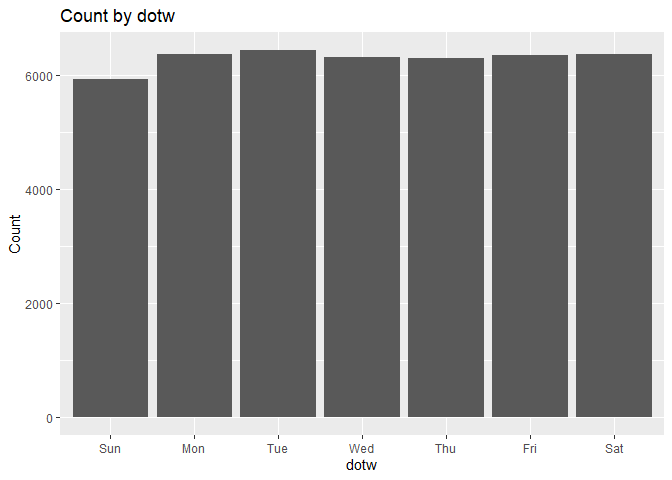

    
# VaBeachEMSData
This repo houses a now deprecated version of the Virginia Beach EMS calls data with xy coordinates.


```r
library(sf)
library(tidyverse)
library(lubridate)
```


```r
dat <- read.csv("https://raw.githubusercontent.com/urbanSpatial/VaBeachEMSData/main/VaBeach_EMS_with_coords_17_18.csv")
```


```r
dat <- 
  dat %>% 
    filter(!is.na(X) & !is.na(Y)) %>% 
    st_as_sf(coords = c("X", "Y"), crs = 4326, agr = "constant") %>%
    mutate(callDate = mdy_hm(CallDateandTime),
           dotw = wday(callDate, label=T))
```


```r
group_by(dat, dotw) %>% summarize(Count = n()) %>%
ggplot(aes(dotw, Count)) + geom_bar(stat="identity") + ggtitle("Count by dotw")
```


