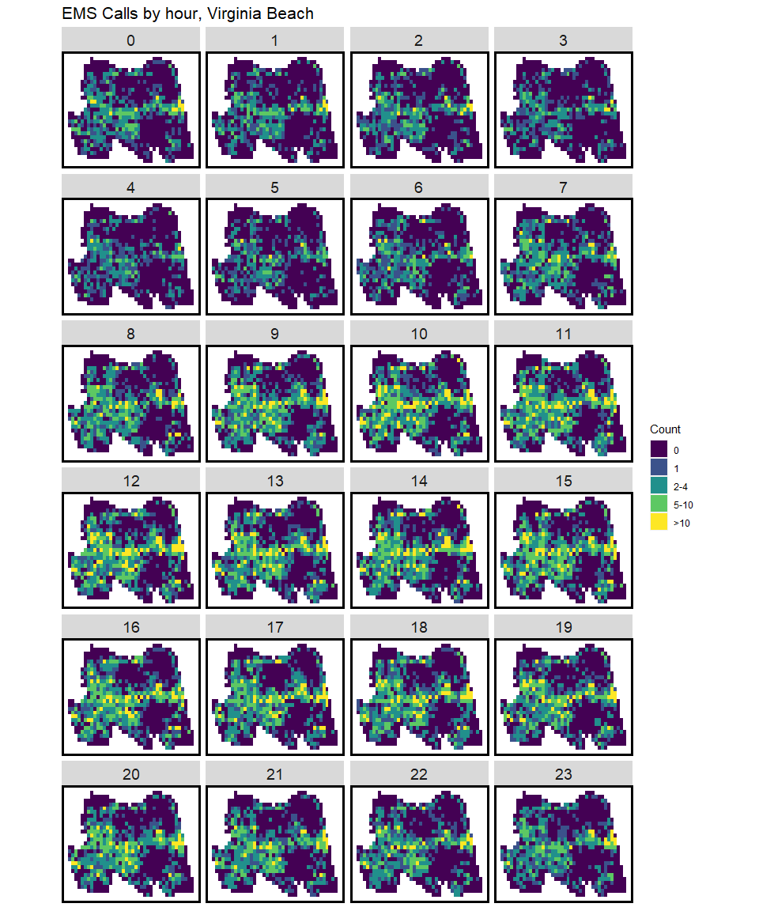

    
# Virginia Beach, Virginia EMS calls w/ geographic coordinates

This repo houses a now deprecated version of the [Virginia Beach EMS calls data](https://data.vbgov.com/dataset/ems-calls-for-service/resource/3e03dc00-a196-48ec-af62-0eaf028f5c27?inner_span=True) with XY coordinates. 

Data from January, 2017 through February, 2018 are included. This dataset is used for a final project option in my course. 

 

    
